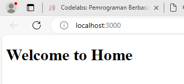
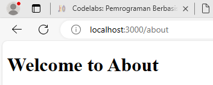
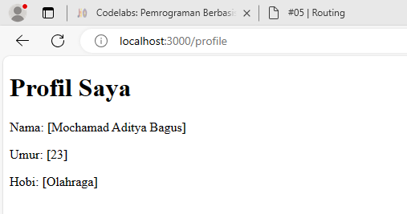

# nama : Mochamad Aditya Bagus

Praktikum 1
1. 
2. 
Todo: Buatlah halaman /profile yang menampilkan isi biodata anda dengan menggunakan routing di NextJS.
3. 

praktikum 2
1. [image](image/2.1.png)
2. [image](image/2.2.png)
3. [image](image/2.3.png)

Pertanyaan: Apa kekurangan yang mungkin terjadi jika menggunakan pendekatan pada Praktikum 2 untuk menangani routing?

Kinerja routing yang bersarang bisa menjadi lebih mahal secara komputasi dibandingkan dengan routing yang lebih sederhana. Ini karena aplikasi harus melakukan pencarian melalui beberapa tingkat routing untuk menemukan rute yang tepat. Hal ini bisa memiliki dampak negatif pada kinerja aplikasi, terutama pada aplikasi yang skala besar dengan lalu lintas yang tinggi.Meskipun ada kekurangan ini, pendekatan routing yang bersarang masih sering digunakan dalam pengembangan aplikasi web, terutama ketika aplikasi menjadi semakin kompleks dan memerlukan organisasi yang lebih terstruktur dari routing. 

praktikum 3
1. [image](image/3.1.png)
2. [image](image/3.2.png)
Todo 1: Perbaiki implementasi Praktikum 2 menggunakan Dynamic Routes
3. [image](image/3.3.png)
Todo 2: Dengan menggunakan konsep Nested Routes dan Dynamic Routes, buatlah halaman dengan routing /products/[productId]/reviews/[reviewId]
4. [image](image/3.4.png)

praktikum 4
1. [image](image/4.1.png)